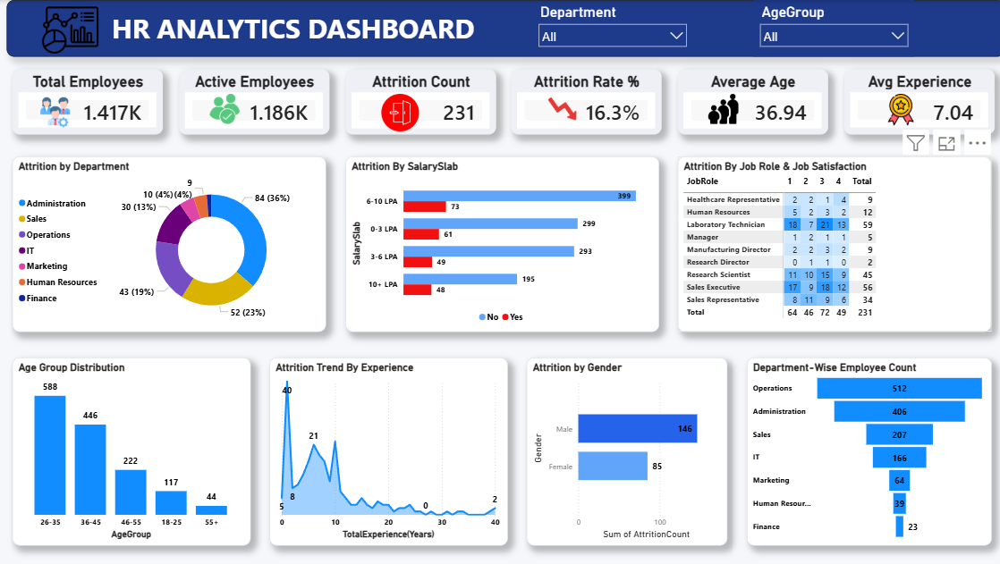

# HR Analytics Dashboard

## 📌 Project Overview

This project is an interactive HR Analytics dashboard built using **Power BI** to analyze employee data and provide insights into workforce trends, employee demographics, attrition, and departmental performance. The dashboard enables HR teams to make data-driven decisions through interactive visualizations.

---

## 🎯 Objectives

- Analyze employee attrition across departments.
- Monitor key workforce KPIs.
- Explore employee demographics.
- Identify trends by age, gender, education, and job role.
- Build an interactive HR reporting dashboard.

---

## 📊 Dashboard Features

- Employee Count KPI
- Attrition Analysis
- Department-wise Employee Distribution
- Gender Distribution
- Age Group Analysis
- Education Field Analysis
- Job Role Analysis
- Interactive Slicers & Filters

---

## 🛠 Tools & Technologies

- Power BI
- Power Query
- DAX
- Microsoft Excel

---

## 📈 Key Insights

- Identified departments with the highest attrition.
- Compared workforce distribution across departments.
- Analyzed employee demographics and job roles.
- Built interactive visuals for HR decision-making.

---

## 📂 Repository Contents

- 📄 HR Analytics Dashboard.pbix
- 🖼 dashboard.png
- 📊 HR_Analytics.csv

---

## 🚀 Skills Demonstrated

- Data Cleaning
- Data Modeling
- DAX
- Power Query
- Dashboard Design
- Data Visualization
- Business Intelligence

---

## 👤 Author

**G. Manodh**

Aspiring Data Analyst | SQL | Power BI | Excel | Python